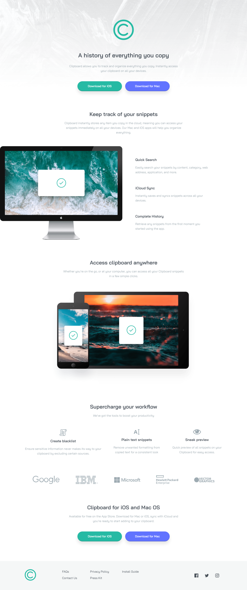

# Frontend Mentor - Clipboard landing page solution

This is a solution to the [Clipboard landing page challenge on Frontend Mentor](https://www.frontendmentor.io/challenges/clipboard-landing-page-5cc9bccd6c4c91111378ecb9). Frontend Mentor challenges help you improve your coding skills by building realistic projects. 

## Table of contents

- [Overview](#overview)
  - [The challenge](#the-challenge)
  - [Screenshot](#screenshot)
  - [Links](#links)
- [My process](#my-process)
  - [Built with](#built-with)
- [Author](#author)

## Overview

Landing page using plain HTML and CSS

### The challenge

Users should be able to:

- View the optimal layout for the site depending on their device's screen size
- See hover states for all interactive elements on the page

### Screenshot

### Links

- Solution URL: [here](https://github.com/pilatech/clipboard-landing-page)
- Live Site URL: [here](https://clipboard-landing-page-by-pilate.netlify.app/)

## My process

 - Created Markup
 - Styled using 'BEM hybrid'

### Built with

- Semantic HTML5 markup
- CSS custom properties
- Flexbox
- Mobile-first workflow

## Author

- Frontend Mentor - [@pilatech](https://www.frontendmentor.io/profile/pilatech)
- Twitter - [pchinyengetere](https://www.twitter.com/pchinyengetere)

